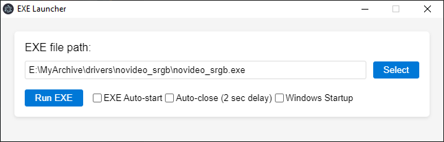
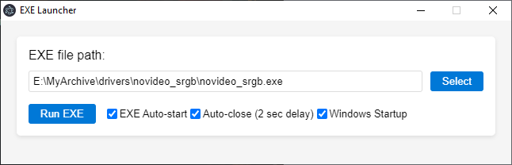

# EXE-Launcher

Allows you to add any executable file and run it at Windows startup.  
The main goal was to work around a bug that prevents **novideo_srgb** from launching with the latest NVIDIA drivers.

## Instructions

1. Launch the application and specify the path to `novideo_srgb.exe`.  
   

2. Click **Run EXE** and configure `novideo_srgb.exe` if you haven’t done so yet.

3. After that, check all the boxes in **EXE Launcher** and close the application (`novideo_srgb.exe` will close automatically).  
   

## How to build from source

1. Install Node.js: https://nodejs.org/en/download/current  
2. Clone the repository: `git clone https://github.com/hadoooooouken/EXE-Launcher.git`  
3. Open **Command Prompt as Administrator** and navigate to the project folder  
4. Run: `npm install`  
5. Run: `npm run build-portable`
